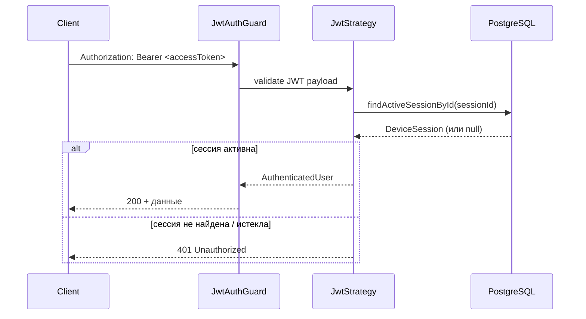

# Auth Module — документация

Документация по модулю авторизации CarAI Backend: архитектура, API, тестирование в Postman и интеграция в другие модули.

---

## Содержание

1. [Обзор](#обзор)
2. [Архитектура](#архитектура)
3. [Модель данных](#модель-данных)
4. [JWT и сессии](#jwt-и-сессии)
5. [API Endpoints](#api-endpoints)
6. [Guards и декораторы](#guards-и-декораторы)
7. [Как защищать эндпоинты в других модулях](#как-защищать-эндпоинты-в-других-модулях)
8. [Тестирование в Postman](#тестирование-в-postman)
9. [Google Sign In](#google-sign-in)
10. [Anonymous → Google Upgrade](#anonymous--google-upgrade)
11. [Переменные окружения](#переменные-окружения)
12. [Swagger](#swagger)
13. [Частые ошибки](#частые-ошибки)

---

## Обзор

Auth-модуль реализует:

| Возможность | Описание |
|---|---|
| Anonymous Login | Создание временного пользователя без регистрации |
| Google Sign In | Вход через Google ID Token |
| Anonymous Upgrade | Привязка Google-аккаунта к существующему anonymous-пользователю |
| JWT Access Token | Короткоживущий токен для API-запросов |
| JWT Refresh Token | Долгоживущий токен для обновления access token |
| Refresh Token Rotation | При каждом refresh выдаётся новая пара токенов |
| DeviceSession | Сессия привязана к устройству и хранится в БД |
| Logout / Logout All | Выход с текущего или всех устройств |

**Базовый URL API:** `http://localhost:3000/api/v1`  
(зависит от `PORT` и `API_PREFIX` в `.env`)

**Swagger UI:** `http://localhost:3000/docs`

---

## Архитектура

```
src/modules/auth/
├── auth.module.ts              # Регистрация модуля, экспорт guards/services
├── controllers/
│   └── auth.controller.ts      # HTTP endpoints
├── services/
│   ├── auth.service.ts         # Бизнес-логика: login, refresh, logout, me
│   ├── token.service.ts        # Генерация и верификация JWT
│   ├── session.service.ts      # DeviceSession: hash, поиск, удаление
│   └── google-auth.service.ts  # Верификация Google ID Token
├── strategies/
│   └── jwt.strategy.ts         # Passport JWT strategy (валидация access token)
├── guards/
│   ├── jwt-auth.guard.ts       # Обязательная авторизация
│   └── optional-auth.guard.ts  # Опциональная авторизация
├── decorators/
│   └── current-user.decorator.ts
├── dto/                        # Request/Response DTO + Swagger
└── interfaces/                 # JwtPayload, AuthenticatedUser и др.
```

### Поток запроса с авторизацией



**Важно:** access token сам по себе недостаточен — `JwtStrategy` дополнительно проверяет, что `DeviceSession` существует в БД и не истёк (`expiresAt > now`). После logout сессия удаляется, и access token перестаёт работать, даже если ещё не истёк по времени JWT.

---

## Модель данных

### User

| Поле | Тип | Описание |
|---|---|---|
| `id` | UUID | Первичный ключ |
| `email` | string? | Email (из Google) |
| `isAnonymous` | boolean | `true` — анонимный пользователь |
| `googleId` | string? | Google `sub`, уникальный |
| `name` | string? | Имя |
| `avatarUrl` | string? | URL аватара |
| `subscriptionTier` | FREE / PREMIUM | Тариф подписки |

### DeviceSession

| Поле | Тип | Описание |
|---|---|---|
| `id` | UUID | ID сессии (= `sessionId` в JWT) |
| `userId` | UUID | Владелец сессии |
| `deviceId` | string | Идентификатор устройства клиента |
| `platform` | string? | ios / android / web |
| `refreshTokenHash` | string | bcrypt hash refresh token (не сам токен!) |
| `expiresAt` | DateTime | Когда сессия истекает |
| `lastActiveAt` | DateTime | Последняя активность |

Один пользователь может иметь несколько `DeviceSession` (телефон, планшет, браузер).

---

## JWT и сессии

### Access Token

- **Секрет:** `JWT_ACCESS_SECRET`
- **TTL:** `JWT_ACCESS_EXPIRES_IN` (по умолчанию `15m`)
- **Передаётся:** заголовок `Authorization: Bearer <token>`
- **Payload:**

```json
{
  "sub": "user-uuid",
  "sessionId": "session-uuid",
  "isAnonymous": true,
  "tier": "FREE"
}
```

### Refresh Token

- **Секрет:** `JWT_REFRESH_SECRET` (отдельный от access!)
- **TTL:** `JWT_REFRESH_EXPIRES_IN` (по умолчанию `30d`)
- **Передаётся:** тело запроса `POST /auth/refresh`
- **В БД хранится только hash** (bcrypt), не сам токен

### Refresh Token Rotation

При каждом `POST /auth/refresh`:

1. Проверяется подпись refresh token
2. Ищется активная `DeviceSession` по `sessionId`
3. Сравнивается hash refresh token с сохранённым в БД
4. Если hash не совпадает → **reuse detected** → удаляются **все** сессии пользователя → `401`
5. Если совпадает → генерируется новая пара токенов, hash обновляется в БД

Это защита от повторного использования украденного refresh token.

---

## API Endpoints

| Метод | URL | Auth | Описание |
|---|---|---|---|
| `GET` | `/auth/me` | Bearer (обязательно) | Профиль текущего пользователя |
| `POST` | `/auth/anonymous` | — | Создать anonymous user + токены |
| `POST` | `/auth/google` | Bearer (опционально) | Google Sign In / Upgrade |
| `POST` | `/auth/refresh` | — | Обновить пару токенов |
| `POST` | `/auth/logout` | Bearer (обязательно) | Logout текущей сессии |
| `POST` | `/auth/logout-all` | Bearer (обязательно) | Logout всех сессий |

### GET /auth/me

**Response (`UserResponseDto`):**

```json
{
  "id": "uuid",
  "email": null,
  "isAnonymous": true,
  "name": null,
  "avatarUrl": null,
  "subscriptionTier": "FREE",
  "createdAt": "2026-06-19T12:00:00.000Z"
}
```

Не возвращаются: `googleId`, `updatedAt`, внутренние поля.

### POST /auth/anonymous

**Request:**

```json
{
  "deviceId": "my-device-001",
  "platform": "ios"
}
```

**Response:**

```json
{
  "accessToken": "eyJ...",
  "refreshToken": "eyJ..."
}
```

### POST /auth/refresh

**Request:**

```json
{
  "refreshToken": "eyJ..."
}
```

**Response:** новая пара `{ accessToken, refreshToken }`

### POST /auth/logout / POST /auth/logout-all

**Response:**

```json
{
  "success": true
}
```

---

## Guards и декораторы

### JwtAuthGuard

Обязательная авторизация. Если токен отсутствует, невалиден или сессия удалена/истекла → `401 Unauthorized`.

```typescript
@UseGuards(JwtAuthGuard)
@Get('me')
me(@CurrentUser() user: AuthenticatedUser) { ... }
```

### OptionalAuthGuard

Авторизация опциональна. Используется на `POST /auth/google`:

- **Без токена** → обычный Google Sign In (новый или существующий пользователь)
- **С токеном anonymous user** → upgrade anonymous → Google
- **С невалидным токеном** → запрос обрабатывается как без авторизации (не 401)

### @CurrentUser()

Декоратор извлекает `AuthenticatedUser` из `request.user`, который заполняет `JwtStrategy`:

```typescript
interface AuthenticatedUser {
  id: string;           // userId (sub из JWT)
  sessionId: string;    // ID текущей DeviceSession
  isAnonymous: boolean;
  tier: 'FREE' | 'PREMIUM';
}
```

Используй `user.id` для фильтрации данных по пользователю в сервисах.

---

## Как защищать эндпоинты в других модулях

### Шаг 1. Импортировать AuthModule

В модуле, где нужна авторизация (например, `vehicles.module.ts`):

```typescript
import { Module } from '@nestjs/common';
import { AuthModule } from '@/modules/auth/auth.module';
import { VehiclesController } from './controllers/vehicles.controller';
import { VehiclesService } from './services/vehicles.service';

@Module({
  imports: [AuthModule],
  controllers: [VehiclesController],
  providers: [VehiclesService],
})
export class VehiclesModule {}
```

`AuthModule` экспортирует `JwtStrategy`, `TokenService`, `SessionService`. После импорта `AuthModule` guard `JwtAuthGuard` будет работать (Passport strategy зарегистрирована глобально внутри модуля).

### Шаг 2. Защитить контроллер или отдельный endpoint

**Весь контроллер:**

```typescript
import { Controller, Get, Post, Body, UseGuards } from '@nestjs/common';
import { ApiBearerAuth, ApiTags } from '@nestjs/swagger';
import { JwtAuthGuard } from '@/modules/auth/guards/jwt-auth.guard';
import { CurrentUser } from '@/modules/auth/decorators/current-user.decorator';
import { AuthenticatedUser } from '@/modules/auth/interfaces/authenticated-user.interface';

@ApiTags('Vehicles')
@ApiBearerAuth()
@UseGuards(JwtAuthGuard)
@Controller('vehicles')
export class VehiclesController {
  @Get()
  findAll(@CurrentUser() user: AuthenticatedUser) {
    return this.vehiclesService.findAllByUser(user.id);
  }

  @Post()
  create(
    @CurrentUser() user: AuthenticatedUser,
    @Body() dto: CreateVehicleDto,
  ) {
    return this.vehiclesService.create(user.id, dto);
  }
}
```

**Только один endpoint:**

```typescript
@UseGuards(JwtAuthGuard)
@Get('my')
findMine(@CurrentUser() user: AuthenticatedUser) { ... }
```

### Шаг 3. Проверять владельца в сервисе

Guard гарантирует, что пользователь **авторизован**. Но он **не проверяет**, что ресурс принадлежит этому пользователю. Это делается в сервисе:

```typescript
async findOne(userId: string, vehicleId: string) {
  const vehicle = await this.prisma.vehicle.findFirst({
    where: { id: vehicleId, userId },
  });

  if (!vehicle) {
    throw new NotFoundException('Vehicle not found');
  }

  return vehicle;
}
```

**Правило:** всегда фильтруй по `userId` из `@CurrentUser()`, никогда не доверяй `userId` из body/query.

### Шаг 4. Различать anonymous и premium (при необходимости)

```typescript
@Post('premium-feature')
@UseGuards(JwtAuthGuard)
premiumFeature(@CurrentUser() user: AuthenticatedUser) {
  if (user.isAnonymous) {
    throw new ForbiddenException('Sign in required');
  }

  if (user.tier !== 'PREMIUM') {
    throw new ForbiddenException('Premium subscription required');
  }

  // ...
}
```

### Шаг 5. Опциональная авторизация в других модулях

Если endpoint работает и для гостей, и для авторизованных:

```typescript
@UseGuards(OptionalAuthGuard)
@Get('public-with-personalization')
getData(@CurrentUser() user?: AuthenticatedUser | null) {
  if (user) {
    return this.service.getPersonalized(user.id);
  }
  return this.service.getPublic();
}
```

### Шаг 6. Swagger для защищённых endpoints

Добавляй `@ApiBearerAuth()` на контроллер или метод, чтобы в Swagger UI появилась кнопка Authorize:

```typescript
@ApiBearerAuth()
@UseGuards(JwtAuthGuard)
@Get()
findAll() { ... }
```

---

## Тестирование в Postman

### Подготовка

1. Запусти backend: `npm run dev`
2. Убедись, что PostgreSQL и Redis работают (Docker Compose или локально)
3. В `.env` заданы `JWT_ACCESS_SECRET`, `JWT_REFRESH_SECRET`, TTL

### Коллекция: базовый flow

#### 1. Anonymous Login

```
POST http://localhost:3000/api/v1/auth/anonymous
Content-Type: application/json

{
  "deviceId": "postman-device-1",
  "platform": "web"
}
```

**Сохрани из ответа:**
- `accessToken` → переменная `accessToken`
- `refreshToken` → переменная `refreshToken`

**Postman tip:** во вкладке *Tests* добавь:

```javascript
const body = pm.response.json();
pm.collectionVariables.set('accessToken', body.accessToken);
pm.collectionVariables.set('refreshToken', body.refreshToken);
```

#### 2. GET /auth/me

```
GET http://localhost:3000/api/v1/auth/me
Authorization: Bearer {{accessToken}}
```

Ожидаемый ответ: `200`, `isAnonymous: true`.

#### 3. Refresh Token

```
POST http://localhost:3000/api/v1/auth/refresh
Content-Type: application/json

{
  "refreshToken": "{{refreshToken}}"
}
```

**Важно:** после refresh обнови переменные `accessToken` и `refreshToken` — старый refresh token больше не валиден.

#### 4. Logout

```
POST http://localhost:3000/api/v1/auth/logout
Authorization: Bearer {{accessToken}}
```

После logout повторный `GET /auth/me` с тем же `accessToken` → `401`.

#### 5. Logout All

```
POST http://localhost:3000/api/v1/auth/logout-all
Authorization: Bearer {{accessToken}}
```

Удаляет все `DeviceSession` пользователя на всех устройствах.

### Проверка rotation (reuse detection)

1. Выполни `POST /auth/refresh` → получи `refreshToken_v2`
2. Попробуй снова отправить **старый** `refreshToken_v1` → `401` + сообщение `Refresh token reuse detected`
3. Даже `refreshToken_v2` тоже перестанет работать (все сессии удалены)

### Postman Environment

Создай Environment с переменными:

| Variable | Initial Value |
|---|---|
| `baseUrl` | `http://localhost:3000/api/v1` |
| `accessToken` | *(пусто, заполняется после login)* |
| `refreshToken` | *(пусто)* |

Authorization для защищённых запросов:

- Type: **Bearer Token**
- Token: `{{accessToken}}`

---

## Google Sign In

### Настройка

1. Создай OAuth 2.0 Client ID в [Google Cloud Console](https://console.cloud.google.com/)
2. Добавь в `.env`:

```
GOOGLE_CLIENT_ID=your-client-id.apps.googleusercontent.com
```

3. На клиенте (iOS/Android/Web) получи `idToken` через Google SDK
4. Отправь его на backend

### POST /auth/google (новый пользователь)

```
POST http://localhost:3000/api/v1/auth/google
Content-Type: application/json

{
  "idToken": "<google_id_token>",
  "deviceId": "postman-device-1",
  "platform": "web"
}
```

**Без** заголовка `Authorization`.

Backend:
1. Верифицирует `idToken` через `google-auth-library`
2. Извлекает `googleId`, `email`, `name`, `avatarUrl`
3. Ищет User по `googleId` → создаёт или обновляет
4. Создаёт `DeviceSession`, возвращает токены

### Как получить idToken для Postman (dev)

Самый простой способ для ручного тестирования:

1. Используй [Google OAuth 2.0 Playground](https://developers.google.com/oauthplayground/)
2. Или временный HTML/JS snippet с Google Sign-In button
3. Или получи token из мобильного клиента через лог

`idToken` живёт ~1 час. Для Postman удобнее тестировать anonymous flow, а Google — через реальный клиент.

---

## Anonymous → Google Upgrade

Сценарий: пользователь начал как anonymous, накопил данные (машины, проблемы), потом привязал Google.

```
POST http://localhost:3000/api/v1/auth/google
Authorization: Bearer {{accessToken}}   ← access token anonymous user
Content-Type: application/json

{
  "idToken": "<google_id_token>",
  "deviceId": "postman-device-1",
  "platform": "web"
}
```

Что происходит:

1. `OptionalAuthGuard` извлекает anonymous user из JWT
2. `user.isAnonymous === true` → вызывается `upgradeAnonymousUser`
3. Обновляется **тот же** `User` (тот же `id`):
   - `isAnonymous = false`
   - `googleId`, `email`, `name`, `avatarUrl`
4. Vehicles, Problems, Chats и др. **остаются** — они привязаны к `userId`
5. Создаётся новая `DeviceSession`, возвращаются новые токены с `isAnonymous: false`

**Конфликт:** если `googleId` уже привязан к другому User → `409 Conflict`.

---

## Переменные окружения

| Переменная | Обязательна | Пример | Описание |
|---|---|---|---|
| `JWT_ACCESS_SECRET` | да | `super_access_secret` | Секрет access token |
| `JWT_REFRESH_SECRET` | да | `super_refresh_secret` | Секрет refresh token |
| `JWT_ACCESS_EXPIRES_IN` | да | `15m` | TTL access token |
| `JWT_REFRESH_EXPIRES_IN` | да | `30d` | TTL refresh token / сессии |
| `GOOGLE_CLIENT_ID` | да | `xxx.apps.googleusercontent.com` | Google OAuth Client ID |

Формат TTL: `15m`, `1h`, `30d` (парсится в `parse-duration.ts`).

---

## Swagger

Swagger UI: `http://localhost:3000/docs`

1. Выполни `POST /auth/anonymous` → скопируй `accessToken`
2. Нажми **Authorize** (замок вверху)
3. Вставь token **без** префикса `Bearer`
4. Теперь можно вызывать защищённые endpoints (`/auth/me`, `/auth/logout`)

`persistAuthorization: true` — token сохраняется при перезагрузке страницы.

---

## Частые ошибки

| Ошибка | Причина | Решение |
|---|---|---|
| `401 Unauthorized` на `/auth/me` | Нет/невалидный token, сессия удалена или истекла | Залогинься заново |
| `401` на `/auth/refresh` | Истёк refresh token или reuse detected | Новый anonymous/google login |
| `401 Invalid Google token` | Невалидный/просроченный idToken или неверный `GOOGLE_CLIENT_ID` | Проверь token и env |
| `409 Conflict` на `/auth/google` | Google аккаунт уже привязан к другому User | Используй другой Google аккаунт |
| `401` после logout | Сессия удалена из БД | Это ожидаемое поведение |
| Guard не работает в другом модуле | Не импортирован `AuthModule` | Добавь `imports: [AuthModule]` |

---

## Рекомендации для разработки новых модулей

1. **Всегда** фильтруй данные по `user.id` из `@CurrentUser()`
2. **Не** принимай `userId` из request body
3. Для CRUD ресурсов пользователя используй паттерн:

   ```
   Controller: @UseGuards(JwtAuthGuard) + @CurrentUser()
   Service:    where: { userId, id: resourceId }
   ```

4. Добавляй `@ApiBearerAuth()` для Swagger
5. Для premium-функций проверяй `user.tier`
6. Для функций, требующих регистрацию, проверяй `!user.isAnonymous`
7. Access token храни в памяти клиента, refresh token — в secure storage (Keychain / EncryptedSharedPreferences / httpOnly cookie)

---

## Диаграмма жизненного цикла пользователя

```
┌─────────────────┐
│ POST /anonymous │──► Anonymous User (isAnonymous: true)
└────────┬────────┘
         │
         │  POST /google + Bearer token
         ▼
┌─────────────────┐
│  Upgrade User   │──► Google User (isAnonymous: false)
│  (same userId)  │    Vehicles, Problems, Chats сохранены
└────────┬────────┘
         │
         │  POST /google (без token)
         ▼
┌─────────────────┐
│  Google Sign In │──► Новый или существующий Google User
└─────────────────┘
```
