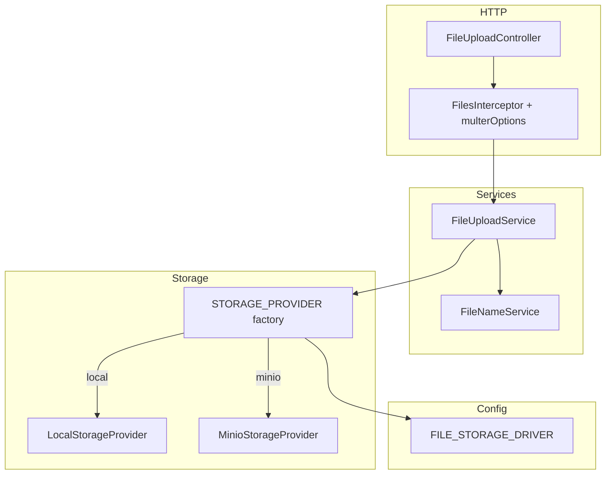
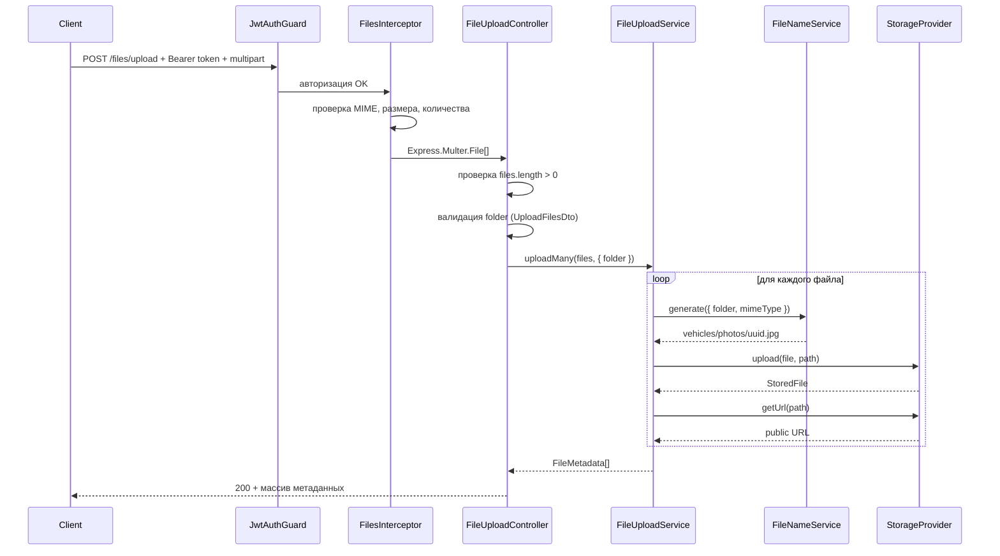

# File Upload Module — документация

Документация по модулю загрузки файлов CarAI Backend: архитектура, storage-провайдеры, API, тестирование и интеграция в другие модули.

---

## Содержание

1. [Обзор](#обзор)
2. [Архитектура](#архитектура)
3. [Поток загрузки файла](#поток-загрузки-файла)
4. [Storage-провайдеры](#storage-провайдеры)
5. [Конфигурация и переменные окружения](#конфигурация-и-переменные-окружения)
6. [API Endpoints](#api-endpoints)
7. [Ограничения и валидация](#ограничения-и-валидация)
8. [Безопасность](#безопасность)
9. [Как использовать в других модулях](#как-использовать-в-других-модулях)
10. [Тестирование](#тестирование)
11. [Swagger](#swagger)
12. [Docker и MinIO](#docker-и-minio)
13. [Расширение модуля](#расширение-модуля)
14. [Частые ошибки](#частые-ошибки)

---

## Обзор

File Upload модуль реализует единый механизм загрузки, хранения и получения URL файлов. Бизнес-логика не привязана к конкретному хранилищу — выбор делается через переменную окружения.

| Возможность | Описание |
|---|---|
| Загрузка нескольких файлов | До 10 файлов за один запрос |
| Поддерживаемые форматы | JPEG, PNG, WebP |
| Лимит размера | 10 MB на файл |
| Local storage | Файлы на диске + раздача через `ServeStaticModule` |
| MinIO storage | S3-совместимое объектное хранилище |
| Strategy pattern | Переключение провайдера без изменения сервисов |
| JWT-защита | Загрузка доступна только авторизованным пользователям |

**Базовый URL API:** `http://localhost:3000/api/v1`  
(зависит от `PORT` и `API_PREFIX` в `.env`)

**Swagger UI:** `http://localhost:3000/docs`

**Эндпоинт загрузки:** `POST /api/v1/files/upload`

---

## Архитектура

Модуль построен по принципу **Strategy**: `FileUploadService` работает с абстракцией `StorageProvider`, а конкретная реализация (local или MinIO) выбирается при старте приложения.

```
src/modules/file-upload/
├── file-upload.module.ts           # Регистрация модуля, factory для STORAGE_PROVIDER
├── controllers/
│   └── file-upload.controller.ts   # HTTP endpoint POST /files/upload
├── services/
│   ├── file-upload.service.ts      # Оркестрация: upload, uploadMany, delete
│   └── file-name.service.ts        # Генерация безопасного пути файла
├── providers/
│   ├── local-storage.provider.ts   # Хранение на локальном диске
│   └── minio-storage.provider.ts   # Хранение в MinIO (S3-compatible)
├── config/
│   └── multer.config.ts            # Настройки Multer: memory storage, лимиты, MIME filter
├── constants/
│   ├── file-upload.constants.ts    # MAX_FILES, MAX_FILE_SIZE, ALLOWED_MIME_TYPES
│   ├── mime-types.constants.ts     # MIME → расширение файла
│   └── storage.constants.ts        # DI token STORAGE_PROVIDER
├── dto/
│   ├── upload-files.dto.ts         # Валидация поля folder
│   └── file-metadata-response.dto.ts
├── enums/
│   └── storage-driver.enum.ts      # local | minio
└── interfaces/
    ├── storage-provider.interface.ts
    ├── stored-file.interface.ts
    ├── file-metadata.interface.ts
    └── upload-options.interface.ts
```

### Ключевые компоненты

| Компонент | Роль |
|---|---|
| `FileUploadController` | Принимает `multipart/form-data`, валидирует наличие файлов, делегирует в сервис |
| `multer` (`FilesInterceptor`) | Парсит multipart, кладёт файлы в RAM (`memoryStorage`), проверяет MIME и размер |
| `FileUploadService` | Генерирует путь, вызывает провайдер, формирует публичный URL |
| `FileNameService` | Создаёт путь вида `{folder}/{uuid}.{ext}` |
| `LocalStorageProvider` | Записывает `file.buffer` на диск в `UPLOAD_DIR` |
| `MinioStorageProvider` | Загружает объект в bucket через MinIO SDK |
| `STORAGE_PROVIDER` (factory) | Выбирает провайдер по `FILE_STORAGE_DRIVER` |

### Диаграмма зависимостей



---

## Поток загрузки файла

### Последовательность шагов



### Что происходит на каждом этапе

1. **JwtAuthGuard** — без валидного access token запрос отклоняется с `401`.
2. **Multer** — файлы читаются в память (`file.buffer`). Диск не используется на этапе приёма.
3. **UploadFilesDto** — поле `folder` валидируется через `class-validator` (глобальный `ValidationPipe`).
4. **FileNameService** — генерирует уникальный путь: `{folder}/{uuid}.{extension}`.
5. **StorageProvider** — сохраняет файл в выбранное хранилище.
6. **FileUploadService** — добавляет публичный `url` к метаданным и возвращает результат.

### Формат ответа (`FileMetadata`)

```json
[
  {
    "path": "vehicles/photos/550e8400-e29b-41d4-a716-446655440000.jpg",
    "url": "http://localhost:3000/uploads/vehicles/photos/550e8400-e29b-41d4-a716-446655440000.jpg",
    "mimeType": "image/jpeg",
    "size": 102400,
    "originalName": "my-car.jpg"
  }
]
```

| Поле | Описание |
|---|---|
| `path` | Относительный путь внутри хранилища. **Сохраняй это значение в БД**, а не полный URL |
| `url` | Публичный URL для отображения файла клиенту |
| `mimeType` | MIME-тип файла |
| `size` | Размер в байтах |
| `originalName` | Исходное имя файла от клиента |

**Рекомендация:** в сущностях (Vehicle, Problem и т.д.) храни `path`, а `url` формируй на лету или через тот же `StorageProvider.getUrl()`. Это позволит сменить `FILE_PUBLIC_URL` или storage driver без миграции URL в БД.

---

## Storage-провайдеры

Оба провайдера реализуют единый интерфейс:

```typescript
interface StorageProvider {
  upload(file: Express.Multer.File, path: string): Promise<StoredFile>;
  delete(path: string): Promise<void>;
  exists(path: string): Promise<boolean>;
  getUrl(path: string): string;
}
```

Выбор провайдера происходит в `file-upload.module.ts`:

```typescript
const driver = configService.getOrThrow<StorageDriver>('FILE_STORAGE_DRIVER');

return driver === StorageDriver.MINIO
  ? minioStorageProvider
  : localStorageProvider;
```

### Local Storage (`FILE_STORAGE_DRIVER=local`)

**Назначение:** разработка, локальные тесты, простые деплои без объектного хранилища.

**Как работает:**

1. При старте читает `UPLOAD_DIR` (например, `uploads`) и `FILE_PUBLIC_URL`.
2. При `upload()`:
   - Строит абсолютный путь: `resolve(UPLOAD_DIR, path)`
   - Проверяет, что путь не выходит за пределы `UPLOAD_DIR` (защита от path traversal)
   - Создаёт промежуточные директории (`mkdir recursive`)
   - Записывает `file.buffer` на диск
3. При `getUrl()` возвращает `{FILE_PUBLIC_URL}/{path}`.
4. Файлы раздаются через `ServeStaticModule` в `app.module.ts`:

```typescript
ServeStaticModule.forRoot({
  rootPath: join(process.cwd(), 'uploads'),
  serveRoot: '/uploads',
});
```

**Схема (local):**

```
Клиент → POST /files/upload
       → LocalStorageProvider пишет в ./uploads/vehicles/photos/uuid.jpg
       → GET /uploads/vehicles/photos/uuid.jpg (ServeStaticModule)
```

| Плюсы | Минусы |
|---|---|
| Простая настройка | Не масштабируется горизонтально (файлы на диске одного инстанса) |
| Не нужен внешний сервис | При нескольких репликах backend файлы не общие |
| Удобно для dev | `ServeStaticModule` жёстко привязан к `./uploads` |

**Важно:** `ServeStaticModule` всегда включён в `AppModule`, даже если используется MinIO. Для MinIO он не нужен, но не мешает работе.

### MinIO Storage (`FILE_STORAGE_DRIVER=minio`)

**Назначение:** production, S3-совместимое хранилище, горизонтальное масштабирование backend.

**Как работает:**

1. При старте создаёт MinIO `Client` из env-переменных.
2. При первом `upload()` проверяет существование bucket (`ensureBucketExists`). Если bucket нет — создаёт автоматически.
3. Загружает объект: `putObject(bucket, path, buffer, size, { Content-Type })`.
4. При `getUrl()` возвращает `{FILE_PUBLIC_URL}/{path}`.

**Схема (minio):**

```
Клиент → POST /files/upload
       → MinioStorageProvider → MinIO bucket "car-ai"
       → GET {FILE_PUBLIC_URL}/vehicles/photos/uuid.jpg
```

`FILE_PUBLIC_URL` при MinIO должен указывать на публично доступный endpoint. Варианты:

| Вариант | Пример `FILE_PUBLIC_URL` |
|---|---|
| MinIO напрямую (dev) | `http://localhost:9000/car-ai` |
| Nginx / CDN перед MinIO | `https://cdn.example.com` |
| Публичный bucket policy | Зависит от настройки MinIO |

**Важно:** модуль **не настраивает** публичный доступ к bucket. Он только загружает файлы и формирует URL. Политику доступа bucket нужно настроить отдельно в MinIO Console или через IaC.

| Плюсы | Минусы |
|---|---|
| S3-compatible API | Нужен отдельный сервис MinIO |
| Масштабируемость | Нужна настройка публичного URL / CDN |
| Один bucket для всех инстансов backend | Bucket policy настраивается вручную |

### Сравнение провайдеров

| Критерий | Local | MinIO |
|---|---|---|
| Env-переменные | `UPLOAD_DIR`, `FILE_PUBLIC_URL` | `MINIO_*`, `FILE_PUBLIC_URL` |
| Где лежат файлы | `./uploads/` на диске | Bucket в MinIO |
| Как отдаются клиенту | `ServeStaticModule` (`/uploads`) | Через `FILE_PUBLIC_URL` |
| Автосоздание хранилища | Директории создаются при upload | Bucket создаётся при первом upload |
| Path traversal защита | Да (`resolveSafePath`) | Не требуется (объектный ключ) |
| Подходит для production | Нет (single-node) | Да |

---

## Конфигурация и переменные окружения

Все переменные валидируются при старте через `envValidationSchema` (`src/config/env.validation.ts`). Условная валидация: MinIO-переменные обязательны только при `FILE_STORAGE_DRIVER=minio`, `UPLOAD_DIR` — только при `local`.

### Переменные

| Переменная | Обязательна | По умолчанию | Описание |
|---|---|---|---|
| `FILE_STORAGE_DRIVER` | нет | `local` | Драйвер хранилища: `local` или `minio` |
| `UPLOAD_DIR` | при `local` | — | Директория для файлов на диске |
| `FILE_PUBLIC_URL` | да | — | Базовый публичный URL для `getUrl()` |
| `MINIO_ENDPOINT` | при `minio` | — | Хост MinIO (`localhost` / `minio` в Docker) |
| `MINIO_PORT` | при `minio` | — | Порт API MinIO (обычно `9000`) |
| `MINIO_USE_SSL` | нет | `false` | HTTPS при подключении к MinIO |
| `MINIO_ACCESS_KEY` | при `minio` | — | Access key |
| `MINIO_SECRET_KEY` | при `minio` | — | Secret key |
| `MINIO_BUCKET` | при `minio` | — | Имя bucket |

### Пример `.env` для local (разработка)

```env
FILE_STORAGE_DRIVER=local
UPLOAD_DIR=uploads
FILE_PUBLIC_URL=http://localhost:3000/uploads
```

### Пример `.env` для MinIO (Docker Compose)

```env
FILE_STORAGE_DRIVER=minio
FILE_PUBLIC_URL=http://localhost:9000/car-ai

MINIO_ENDPOINT=minio
MINIO_PORT=9000
MINIO_USE_SSL=false
MINIO_ACCESS_KEY=minioadmin
MINIO_SECRET_KEY=minioadmin
MINIO_BUCKET=car-ai
```

**Docker tip:** внутри Docker-сети backend обращается к MinIO по hostname `minio` (имя сервиса в `docker-compose.yml`), а не `localhost`.

---

## API Endpoints

| Метод | URL | Auth | Описание |
|---|---|---|---|
| `POST` | `/files/upload` | Bearer (обязательно) | Загрузить один или несколько файлов |

### POST /files/upload

**Content-Type:** `multipart/form-data`

**Поля формы:**

| Поле | Тип | Обязательно | Описание |
|---|---|---|---|
| `files` | `File[]` | да | Массив файлов (поле формы называется `files`) |
| `folder` | `string` | да | Целевая папка, например `vehicles/photos` |

**Пример ответа `200`:**

```json
[
  {
    "path": "vehicles/photos/550e8400-e29b-41d4-a716-446655440000.jpg",
    "url": "http://localhost:3000/uploads/vehicles/photos/550e8400-e29b-41d4-a716-446655440000.jpg",
    "mimeType": "image/jpeg",
    "size": 245760,
    "originalName": "car-front.jpg"
  }
]
```

**Коды ответов:**

| Код | Когда |
|---|---|
| `200` | Файлы успешно загружены |
| `400` | Нет файлов, невалидный `folder`, неподдерживаемый MIME, превышен размер |
| `401` | Нет или невалидный access token |

---

## Ограничения и валидация

Константы определены в `src/modules/file-upload/constants/file-upload.constants.ts`:

| Ограничение | Значение |
|---|---|
| Максимум файлов за запрос | 10 (`MAX_FILES`) |
| Максимальный размер файла | 10 MB (`MAX_FILE_SIZE`) |
| Допустимые MIME-типы | `image/jpeg`, `image/png`, `image/webp` |
| Максимальная длина `folder` | 120 символов |

### Валидация `folder`

Поле `folder` проверяется регулярным выражением:

```
^[a-zA-Z0-9][a-zA-Z0-9/_-]*$
```

Допустимо: `vehicles`, `vehicles/photos`, `user-123/avatar`  
Недопустимо: `../etc`, `/absolute`, `folder with spaces`, пустая строка

`FileNameService` дополнительно убирает ведущие и завершающие `/`.

### Валидация MIME-типа

Проверка происходит **дважды** (defence in depth):

1. **Multer `fileFilter`** — отклоняет файл до попадания в сервис
2. **FileNameService** — проверяет наличие расширения в `MIME_TYPE_EXTENSIONS`

---

## Безопасность

| Мера | Где реализована |
|---|---|
| JWT-авторизация | `JwtAuthGuard` на контроллере |
| Ограничение MIME | `multer.config.ts` → `fileFilter` |
| Ограничение размера | `multer.config.ts` → `limits.fileSize` |
| Ограничение количества | `FilesInterceptor('files', MAX_FILES)` |
| Валидация `folder` | `UploadFilesDto` → `@Matches(FOLDER_PATH_PATTERN)` |
| Path traversal (local) | `LocalStorageProvider.resolveSafePath()` |
| Уникальные имена файлов | UUID вместо `originalname` (защита от перезаписи и спецсимволов) |

### Path traversal (local storage)

Если злоумышленник передаст `folder=../../etc`, `LocalStorageProvider` отклонит путь:

```typescript
const fullPath = resolve(this.uploadDir, path);
if (!fullPath.startsWith(`${resolvedUploadDir}/`)) {
  throw new BadRequestException('Invalid file path');
}
```

Даже если валидация DTO будет обойдена, запись за пределы `UPLOAD_DIR` невозможна.

---

## Как использовать в других модулях

Модуль экспортирует `FileUploadService`. Есть два типичных сценария интеграции.

### Сценарий 1. Клиент загружает файлы через API модуля (текущая реализация)

Клиент вызывает `POST /files/upload`, получает `path` и `url`, затем передаёт `path` (или `url`) в другой endpoint — например, при создании Vehicle.

```
1. POST /files/upload        → [{ path: "vehicles/photos/uuid.jpg", url: "..." }]
2. POST /vehicles            → { brand: "Toyota", photoPath: "vehicles/photos/uuid.jpg" }
```

В этом случае другим модулям **не нужно** импортировать `FileUploadModule` — достаточно принять `path` как строку в DTO и сохранить в БД.

### Сценарий 2. Другой модуль загружает файлы программно

Если backend сам принимает файл (например, через свой контроллер) и хочет использовать ту же логику хранения:

#### Шаг 1. Импортировать FileUploadModule

```typescript
import { Module } from '@nestjs/common';
import { FileUploadModule } from '@/modules/file-upload/file-upload.module';
import { VehiclesService } from './services/vehicles.service';
import { VehiclesController } from './controllers/vehicles.controller';

@Module({
  imports: [FileUploadModule],
  controllers: [VehiclesController],
  providers: [VehiclesService],
})
export class VehiclesModule {}
```

#### Шаг 2. Инжектить FileUploadService

```typescript
import { Injectable } from '@nestjs/common';
import { FileUploadService } from '@/modules/file-upload/services/file-upload.service';

@Injectable()
export class VehiclesService {
  constructor(private readonly fileUploadService: FileUploadService) {}

  async attachPhoto(file: Express.Multer.File, vehicleId: string) {
    const metadata = await this.fileUploadService.upload(file, {
      folder: `vehicles/${vehicleId}/photos`,
    });

    // Сохранить metadata.path в БД
    return metadata;
  }
}
```

#### Шаг 3. Удаление файла при удалении сущности

```typescript
async deleteVehicle(vehicleId: string) {
  const vehicle = await this.findOne(vehicleId);

  if (vehicle.photoPath) {
    await this.fileUploadService.delete(vehicle.photoPath);
  }

  await this.prisma.vehicle.delete({ where: { id: vehicleId } });
}
```

### Доступные методы FileUploadService

| Метод | Сигнатура | Описание |
|---|---|---|
| `upload` | `(file, { folder }) → FileMetadata` | Загрузить один файл |
| `uploadMany` | `(files[], { folder }) → FileMetadata[]` | Загрузить несколько файлов параллельно |
| `delete` | `(path) → void` | Удалить файл по `path` |

### Рекомендуемая структура `folder`

Используй иерархию, привязанную к домену:

```
vehicles/{vehicleId}/photos
problems/{problemId}/attachments
users/{userId}/avatars
diagnosis/{sessionId}/images
```

Это упрощает навигацию в хранилище, отладку и массовое удаление при удалении сущности.

### Что хранить в БД

| Хранить | Не хранить (или хранить опционально) |
|---|---|
| `path` | Полный `url` как единственный идентификатор |
| `mimeType`, `size` (при необходимости) | `originalName` (если не нужен UI) |

---

## Тестирование

### Подготовка

1. Запусти инфраструктуру:

```bash
docker compose up -d
```

2. Запусти backend:

```bash
npm run dev
```

3. Получи access token (см. [docs/auth.md](./auth.md)):

```
POST http://localhost:3000/api/v1/auth/anonymous
```

### Тестирование в Postman

#### 1. Получить access token

```
POST {{baseUrl}}/auth/anonymous
Content-Type: application/json

{
  "deviceId": "postman-device-1",
  "platform": "web"
}
```

Сохрани `accessToken` в переменную коллекции.

#### 2. Загрузить один файл

```
POST {{baseUrl}}/files/upload
Authorization: Bearer {{accessToken}}
Content-Type: multipart/form-data

files:   [выбрать файл .jpg / .png / .webp]
folder:  vehicles/photos
```

**Настройка в Postman:**

1. Метод: `POST`
2. Body → `form-data`
3. Ключ `files` → тип **File** → выбрать изображение
4. Ключ `folder` → тип **Text** → значение `vehicles/photos`
5. Authorization → Bearer Token → `{{accessToken}}`

#### 3. Загрузить несколько файлов

Добавь несколько строк с ключом `files` (тип File) в form-data. Multer соберёт их в массив.

#### 4. Проверить доступность файла (local storage)

Скопируй `url` из ответа и открой в браузере:

```
GET http://localhost:3000/uploads/vehicles/photos/<uuid>.jpg
```

Должен вернуться `200` с изображением.

#### 5. Негативные сценарии

| Сценарий | Ожидание |
|---|---|
| Без Authorization header | `401` |
| Без файлов (только `folder`) | `400` At least one file is required |
| Файл > 10 MB | `400` от Multer |
| Файл .pdf / .gif | `400` Unsupported file type |
| `folder=../../etc` | `400` validation error |
| 11 файлов за раз | `400` от Multer (лимит) |

### Тестирование через curl

```bash
# 1. Получить token
TOKEN=$(curl -s -X POST http://localhost:3000/api/v1/auth/anonymous \
  -H "Content-Type: application/json" \
  -d '{"deviceId":"curl-test","platform":"web"}' \
  | jq -r '.accessToken')

# 2. Загрузить файл
curl -X POST http://localhost:3000/api/v1/files/upload \
  -H "Authorization: Bearer $TOKEN" \
  -F "files=@/path/to/photo.jpg" \
  -F "folder=vehicles/photos"
```

### Проверка local storage на диске

После загрузки с `FILE_STORAGE_DRIVER=local` файл должен появиться:

```
./uploads/vehicles/photos/<uuid>.jpg
```

### Проверка MinIO storage

1. Установи в `.env`:

```env
FILE_STORAGE_DRIVER=minio
MINIO_ENDPOINT=localhost
```

2. Загрузи файл через API.
3. Открой MinIO Console: `http://localhost:9001`
4. Логин: `minioadmin` / `minioadmin` (из `.env`)
5. Проверь bucket `car-ai` — объект должен быть по пути `vehicles/photos/<uuid>.jpg`

### Postman Environment

| Variable | Initial Value |
|---|---|
| `baseUrl` | `http://localhost:3000/api/v1` |
| `accessToken` | *(пусто, заполняется после login)* |

---

## Swagger

Swagger UI: `http://localhost:3000/docs`

1. Выполни `POST /auth/anonymous` → скопируй `accessToken`
2. Нажми **Authorize** → вставь token
3. Найди секцию **Files** → `POST /files/upload`
4. Заполни `folder`, прикрепи файлы в поле `files`
5. Execute

Swagger корректно отображает `multipart/form-data` благодаря `@ApiConsumes` и `@ApiBody`.

---

## Docker и MinIO

В `docker-compose.yml` поднят сервис MinIO:

| Сервис | Порт | Назначение |
|---|---|---|
| `minio` | `9000` | S3 API |
| `minio` | `9001` | Web Console |

Backend (`app`) зависит от `minio` (`condition: service_started`).

### Типичная конфигурация для Docker

**В контейнере backend** (`.env`):

```env
FILE_STORAGE_DRIVER=minio
MINIO_ENDPOINT=minio
MINIO_PORT=9000
MINIO_ACCESS_KEY=minioadmin
MINIO_SECRET_KEY=minioadmin
MINIO_BUCKET=car-ai
FILE_PUBLIC_URL=http://localhost:9000/car-ai
```

**На хосте для local dev** (без Docker для app):

```env
FILE_STORAGE_DRIVER=local
UPLOAD_DIR=uploads
FILE_PUBLIC_URL=http://localhost:3000/uploads
```

---

## Расширение модуля

### Добавить новый MIME-тип (например, `image/gif`)

1. Добавь в `ALLOWED_MIME_TYPES` (`file-upload.constants.ts`)
2. Добавь маппинг в `MIME_TYPE_EXTENSIONS` (`mime-types.constants.ts`)

```typescript
// mime-types.constants.ts
'image/gif': 'gif',
```

### Добавить новый storage-провайдер (например, AWS S3)

1. Создай `providers/s3-storage.provider.ts`, реализуй `StorageProvider`
2. Добавь значение в `StorageDriver` enum
3. Зарегистрируй провайдер в `file-upload.module.ts`
4. Обнови factory для `STORAGE_PROVIDER`
5. Добавь env-переменные в `env.validation.ts` и `.env.example`

### Добавить эндпоинт удаления файла

Сейчас `FileUploadService.delete()` есть, но HTTP endpoint не экспонирован. При необходимости:

```typescript
@Delete(':path')
@UseGuards(JwtAuthGuard)
async delete(@Param('path') path: string) {
  await this.fileUploadService.delete(path);
  return { success: true };
}
```

Не забудь проверять владельца файла (привязку `path` к `userId` в БД).

### Rollback при ошибке в uploadMany

Сейчас `uploadMany` использует `Promise.all` — файлы загружаются параллельно. Если один упадёт, уже загруженные файлы останутся в хранилище. Для production можно добавить compensating delete при ошибке.

---

## Частые ошибки

| Ошибка | Причина | Решение |
|---|---|---|
| `401 Unauthorized` | Нет или просрочен access token | Выполни `POST /auth/anonymous` или refresh |
| `400 At least one file is required` | Поле `files` пустое | Прикрепи хотя бы один файл в form-data |
| `400 Unsupported file type` | MIME не в списке (jpeg/png/webp) | Используй поддерживаемый формат |
| `400 File too large` | Файл > 10 MB | Уменьши файл или измени `MAX_FILE_SIZE` |
| `400 folder must contain only...` | Невалидный `folder` | Используй `[a-zA-Z0-9/_-]`, без `..` и пробелов |
| Файл загружен, но URL не открывается (local) | Неверный `FILE_PUBLIC_URL` или `ServeStaticModule` | Проверь `FILE_PUBLIC_URL=http://localhost:3000/uploads` |
| Файл загружен, но URL не открывается (minio) | Bucket не публичный / неверный `FILE_PUBLIC_URL` | Настрой bucket policy в MinIO Console |
| `Error: connect ECONNREFUSED` (minio) | MinIO не запущен или неверный `MINIO_ENDPOINT` | `docker compose up -d minio`, в Docker используй `minio` вместо `localhost` |
| Приложение не стартует | Не заданы обязательные env для выбранного driver | Проверь `env.validation.ts` и `.env` |
| `FileUploadService` не инжектится | Не импортирован `FileUploadModule` | Добавь `imports: [FileUploadModule]` |

---

## Рекомендации для разработки

1. **В БД храни `path`**, не полный URL
2. **Привязывай `folder` к доменной сущности**: `vehicles/{id}/photos`
3. **При удалении сущности** удаляй связанные файлы через `fileUploadService.delete()`
4. **Для production** используй `FILE_STORAGE_DRIVER=minio` (или S3)
5. **Не принимай `folder` от клиента без валидации** — текущий DTO уже защищён, сохраняй этот паттерн
6. **Проверяй владельца файла** при удалении — `path` из запроса нельзя доверять без проверки в БД
7. **Тестируй оба driver'а** перед релизом: local для dev, minio для staging/production

---

## Диаграмма выбора storage driver

```
                    ┌─────────────────────┐
                    │  FILE_STORAGE_DRIVER │
                    └──────────┬──────────┘
                               │
              ┌────────────────┴────────────────┐
              │                                 │
              ▼                                 ▼
     ┌────────────────┐              ┌────────────────┐
     │     local      │              │     minio      │
     └───────┬────────┘              └───────┬────────┘
             │                               │
             ▼                               ▼
   LocalStorageProvider            MinioStorageProvider
             │                               │
             ▼                               ▼
   ./uploads/{path}                  s3://bucket/{path}
             │                               │
             ▼                               ▼
   ServeStaticModule                  FILE_PUBLIC_URL
   GET /uploads/{path}                GET {FILE_PUBLIC_URL}/{path}
```
