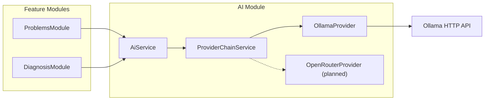

# AI Module

Инфраструктурный модуль для работы с LLM-провайдерами. Другие модули приложения (Problems, Diagnosis и т.д.) **не должны** напрямую обращаться к Ollama, OpenRouter или HTTP-клиентам — только через `AiService`.

## Архитектура



### Слои

| Слой | Класс | Ответственность |
|------|-------|-----------------|
| Публичный API | `AiService` | Единая точка входа для feature-модулей |
| Оркестрация | `ProviderChainService` | Fallback-цепочка провайдеров |
| Провайдеры | `OllamaProvider`, … | Адаптеры к конкретным LLM API |
| Конфигурация | `ai.config.ts` | Чтение env-переменных |

### Цепочка провайдеров (fallback)

`AI_PROVIDER` задаёт **порядок** провайдеров через запятую, например:

```env
AI_PROVIDER=ollama,openrouter
```

`ProviderChainService` вызывает провайдеры по порядку:

1. Берёт первый провайдер из списка.
2. Если запрос успешен — возвращает результат.
3. Если провайдер упал — логирует предупреждение и пробует следующий.
4. Если все провайдеры упали — выбрасывает `ServiceUnavailableException`.

Провайдеры, которые ещё не реализованы, **пропускаются при старте** с warning в логах (см. `AiProvidersFactory`).

## Структура каталогов

```
src/infrastructure/ai/
├── ai.module.ts                  # NestJS-модуль
├── config/
│   └── ai.config.ts              # registerAs('ai', ...)
├── constants/
│   └── ai.constants.ts           # DI-токен AI_PROVIDERS
├── enums/
│   └── ai-provider.enum.ts       # OLLAMA, OPENROUTER
├── interfaces/
│   ├── ai-provider.interface.ts  # Контракт провайдера
│   ├── ai-request.interface.ts   # Входной запрос
│   └── ai-response.interface.ts  # Ответ
├── providers/
│   ├── ai-providers.factory.ts   # Сборка цепочки из env
│   ├── provider-chain.service.ts # Fallback-логика
│   └── ollama/
│       ├── ollama.provider.ts
│       └── interfaces/
├── services/
│   └── ai.service.ts             # Публичный сервис
└── README.md
```

## Конфигурация

Переменные окружения (см. также `.env.example` и `src/config/env.validation.ts`):

| Переменная | Обязательность | Описание |
|------------|----------------|----------|
| `AI_PROVIDER` | **required** | Список провайдеров через запятую: `ollama`, `openrouter` |
| `AI_REQUEST_TIMEOUT_MS` | optional (default: `120000`) | Таймаут HTTP-запросов к провайдерам |
| `OLLAMA_URL` | required, если в `AI_PROVIDER` есть `ollama` | Базовый URL Ollama, напр. `http://localhost:11434` |
| `OLLAMA_MODEL` | required, если в `AI_PROVIDER` есть `ollama` | Имя модели, напр. `qwen3:8b` |
| `OPENROUTER_API_KEY` | optional | API-ключ OpenRouter (для будущего провайдера) |
| `OPENROUTER_MODEL` | optional | Модель OpenRouter |

Пример для локальной разработки с Ollama:

```env
AI_PROVIDER=ollama
AI_REQUEST_TIMEOUT_MS=120000
OLLAMA_URL=http://host.docker.internal:11434
OLLAMA_MODEL=qwen3:8b
```

## Использование в других модулях

### 1. Импортировать `AiModule`

```typescript
import { Module } from '@nestjs/common';
import { AiModule } from '@/infrastructure/ai/ai.module';
import { ProblemDiagnosisService } from './services/problem-diagnosis.service';

@Module({
  imports: [AiModule],
  providers: [ProblemDiagnosisService],
})
export class DiagnosisModule {}
```

### 2. Инжектить `AiService`

```typescript
import { Injectable } from '@nestjs/common';
import { AiService } from '@/infrastructure/ai/services/ai.service';

@Injectable()
export class ProblemDiagnosisService {
  constructor(private readonly aiService: AiService) {}

  async summarizeProblem(description: string): Promise<string> {
    const response = await this.aiService.generate({
      prompt: `Summarize this car problem in one sentence:\n${description}`,
    });

    return response.content;
  }
}
```

### 3. Запрос с изображениями (vision-модели Ollama)

```typescript
const response = await this.aiService.generate({
  prompt: 'What damage do you see in this photo?',
  images: [photoBuffer],
});
```

Буферы автоматически конвертируются в base64 для Ollama API.

## Контракты

### `AiRequest`

```typescript
interface AiRequest {
  prompt: string;
  images?: Buffer[]; // опционально, для vision-моделей
}
```

### `AiResponse`

```typescript
interface AiResponse {
  content: string;           // текст ответа модели
  model: string;             // фактически использованная модель
  platform: AiProviderType;  // 'ollama' | 'openrouter'
}
```

### `AiProvider`

Каждый провайдер реализует:

```typescript
interface AiProvider {
  readonly type: AiProviderType;
  generate(request: AiRequest): Promise<AiResponse>;
}
```

## Добавление нового провайдера

Пример: OpenRouter.

### Шаг 1. Создать провайдер

```
src/infrastructure/ai/providers/openrouter/
├── openrouter.provider.ts
└── interfaces/
    ├── openrouter-request.interface.ts
    └── openrouter-response.interface.ts
```

```typescript
import { Injectable } from '@nestjs/common';
import { AiProvider } from '../../interfaces/ai-provider.interface';
import { AiProviderType } from '../../enums/ai-provider.enum';

@Injectable()
export class OpenRouterProvider implements AiProvider {
  readonly type = AiProviderType.OPENROUTER;

  async generate(request: AiRequest): Promise<AiResponse> {
    // HTTP-запрос к OpenRouter API
  }
}
```

### Шаг 2. Зарегистрировать в `AiProvidersFactory`

```typescript
const registry = new Map<string, AiProvider>([
  [AiProviderType.OLLAMA, this.ollamaProvider],
  [AiProviderType.OPENROUTER, this.openRouterProvider], // добавить
]);
```

### Шаг 3. Добавить провайдер в `ai.module.ts`

```typescript
providers: [
  // ...
  OpenRouterProvider,
  AiProvidersFactory,
],
```

И обновить `inject` в фабрике, если нужны новые зависимости.

### Шаг 4. Обновить env и валидацию

- Добавить переменные в `ai.config.ts`
- Добавить правила в `env.validation.ts`
- Обновить `.env.example`

### Шаг 5. Включить в цепочку

```env
AI_PROVIDER=openrouter,ollama
```

OpenRouter будет первым (primary), Ollama — fallback.

## Обработка ошибок

| Ситуация | Поведение |
|----------|-----------|
| Первый провайдер упал | Warning в лог + попытка следующего |
| Все провайдеры упали | `ServiceUnavailableException` с `cause` |
| Нет доступных провайдеров при старте | Ошибка инициализации модуля |
| Ollama недоступен | `InternalServerErrorException` внутри провайдера → chain пробует следующий |

## Что **не** нужно делать

- Не импортировать `OllamaProvider` или `HttpService` в feature-модулях.
- Не читать `OLLAMA_URL` / `OPENROUTER_API_KEY` напрямую из env в бизнес-логике.
- Не дублировать fallback-логику — она уже в `ProviderChainService`.

## Текущий статус провайдеров

| Провайдер | Статус |
|-----------|--------|
| Ollama | ✅ Реализован |
| OpenRouter | ⏳ Запланирован (enum и config уже есть) |
